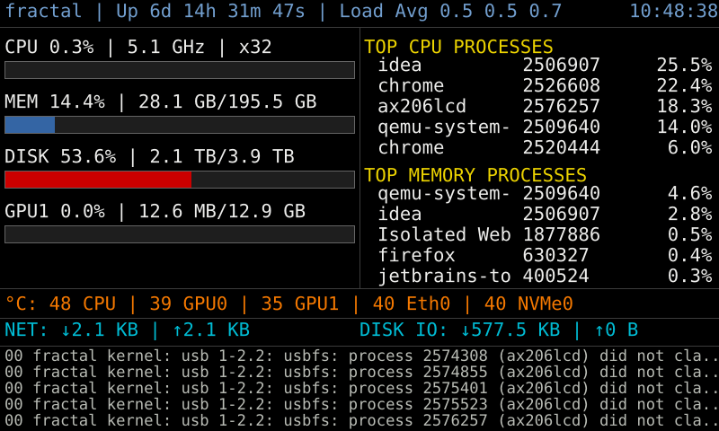

# Rust AX206LCD

A Rust implementation of the AX206LCD display driver and system dashboard.

## Description

This project is my first attempt at a Rust project. It was initially being created using Python and basing off @nak435 (https://qiita.com/nak435/items/e0802355dad0f0865c69) interface to the AX206 USB display. I had a prototype of this project working on Python, but wanted to experiment and learn Rust, so what better way to learn than to translate from one language to another that is not yet known.

This project allows you to display system information and custom images on an AX206LCD display device.

Caveats:
* I'm primarly a Java developer with Python/Javascript as my secondary languages.  

## What is AX206?

The AX206 is a USB-connected LCD display device that can be controlled via USB SCSI commands. It features a small colour display that can show images and information. The device is identified by its vendor ID (0x1908) and product ID (0x0102). This project provides an interface to communicate with the AX206 display, allowing you to show system information dashboards or custom images.

## Features

- USB communication with AX206LCD devices
- System information collection (CPU, memory, disc, network, etc.)
- System dashboard generation with resource usage graphs
- Configuration via config.ini file
- Error handling and logging

## Installation

### Prerequisites

- Rust and Cargo (latest stable version)
- Linux system with USB support
- AX206LCD compatible display device
- Required system packages:
  - `libusb-1.0-0-dev` (for USB communication)
  - `lm-sensors` (for temperature monitoring)

### Building

```bash
# Clone the repository
git clone https://github.com/ep9/rust-x206LCD.git
cd rust-x206LCD

# Build the project
cargo build --release
```

## Usage

```bash
# Run the application
cargo run --release

# Or use the built binary
./target/release/rust-x206LCD
```

## Configuration

The application is configured via the `config.ini` file:

```ini
[LCD]
backlight = 1        # Backlight brightness (0-7)
width = 800          # LCD width in pixels
height = 480         # LCD height in pixels
file = current.png   # Image file to display
polling = 5          # Update interval in seconds
vid = 0x1908         # Vendor ID for the USB device
pid = 0x0102         # Product ID for the USB device

[DASHBOARD]
file = dashboard.png  # Dashboard image file
enabled = true        # Enable dashboard generation
save_to_file = false  # Save dashboard to file

[RESOURCES]
# Disks to monitor (can specify multiple)
disks = "nvme0n1"
disks = "sda1"

# Network interfaces to monitor (can specify multiple)
networks = "enp13s0"
networks = "enx0024278838ca"

# Mount points to monitor (can specify multiple)
mount_points = "/"

# Temperature sensors to monitor
[RESOURCES.sensors]
k10temp = "CPU"
amdgpu = "GPU0"
"NVIDIA RTX A2000" = "GPU1"
r8169 = "Eth0"
"nvme composite" = "NVMe0"
```

## Example Dashboard

Below is an example of the dashboard image generated by the application:



The dashboard is divided into four main sections:

1. **Header** - Displays system time, uptime, and load information at the top of the dashboard.

2. **Left Panel** - Shows resource usage graphs for CPU, memory, disk, and GPU utilization.

3. **Right Panel** - Lists top processes based on PS outputs, showing the most resource-intensive applications currently running.

4. **Footer** - Contains three subsections:
   - Resource temperatures (CPU, GPU, etc.)
   - Network and disk I/O statistics
   - Most recent syslog lines for system monitoring

## AX206LCD Protocol

The AX206LCD device communicates using the USB Mass Storage Class - Bulk Only Transport protocol. Below are the key details of this protocol implementation:

### Endpoints

The device uses the following endpoints for bulk data transfer:
- PC → LCD: 0x01 (OUT endpoint)
- LCD → PC: 0x81 (IN endpoint)

### Command Block Wrapper (CBW)

The CBW is a 31-byte structure used to send commands to the device:

| Offset | Parameter              | Content                                |
|--------|------------------------|----------------------------------------|
| 0-3    | dCBWSignature          | 0x55 0x53 0x42 0x43 ("USBC")          |
| 4-7    | dCBWTag                | 0xde 0xad 0xbe 0xef                   |
| 8-11   | dCBWDataTransferLength | Data transfer length (little endian)   |
| 12     | bmCBWFlags             | 0x80: Data In (LCD → PC)              |
|        |                        | 0x00: Data Out (PC → LCD)              |
| 13     | bCBWLUN                | 0x00                                   |
| 14     | bCBWCBLength           | 0x10 (CBWCB length)                    |
| 15-30  | CBWCB                  | Command Block                          |

### Command Status Wrapper (CSW)

The CSW is a 13-byte structure returned by the device after a command:

| Offset | Parameter        | Content                                |
|--------|------------------|----------------------------------------|
| 0-3    | dCSWSignature    | 0x55 0x53 0x42 0x53 ("USBS")          |
| 4-7    | dCSWTag          | 0xde 0xad 0xbe 0xef                   |
| 8-11   | dCSWDataResidue  | 0x00 0x00 0x00 0x00 0x00              |
| 12     | bCSWStatus       | 0x00: Command Passed (good status)     |
|        |                  | 0x01: Command Failed                   |
|        |                  | 0x02: Phase Error                      |

### Command Types

There are three main command types used with the AX206LCD:

#### 1. LCD Size Retrieval

| Offset | Content                      |
|--------|------------------------------|
| 0      | 0xcd                         |
| 1-4    | 0x00 0x00 0x00 0x00          |
| 5      | 0x02: get LCD parameters      |
| 6-15   | 0x00 --- 0x00                |

Response (5 bytes):
- Bytes 0-1: Width (little endian, e.g., 0xe0 0x01 = 480)
- Bytes 2-3: Height (little endian, e.g., 0x40 0x01 = 320)
- Byte 4: 0xff

#### 2. Backlight Setting

| Offset | Content                      |
|--------|------------------------------|
| 0      | 0xcd                         |
| 1-4    | 0x00 0x00 0x00 0x00          |
| 5      | 0x06: set LCD backlight       |
| 6      | 0x01                         |
| 7      | 0x01                         |
| 8      | 0x00                         |
| 9      | 0x00-0x07: brightness level   |
| 10-15  | 0x00 --- 0x00                |

#### 3. Image Data Transfer

| Offset | Content                      |
|--------|------------------------------|
| 0      | 0xcd                         |
| 1-4    | 0x00 0x00 0x00 0x00          |
| 5-6    | 0x06 0x12                    |
| 7-8    | x0 (little endian, e.g., 0x00 0x00 = 0) |
| 9-10   | y0 (little endian, e.g., 0x00 0x00 = 0) |
| 11-12  | x1 (little endian, e.g., 0xdf 0x01 = 479) |
| 13-14  | y1 (little endian, e.g., 0x3f 0x01 = 319) |
| 15     | 0x00                         |

After this command, the RGB565 image data for the specified rectangle (x0,y0)-(x1,y1) is sent.

## Project Structure

- `src/main.rs` - Main application entry point
- `src/lib.rs` - Library entry point
- `src/client/` - Client modules for device communication
  - `src/client/ax206lcd.rs` - AX206LCD device driver
- `src/config/` - Configuration handling
- `src/collectors/` - System information collection modules
  - `src/collectors/collector.rs` - Main collector orchestration
  - `src/collectors/cpu.rs` - CPU information collection
  - `src/collectors/disk.rs` - Disc information collection
  - `src/collectors/memory.rs` - Memory information collection
  - `src/collectors/network.rs` - Network information collection
  - `src/collectors/nvidia.rs` - NVIDIA GPU information collection
  - `src/collectors/system.rs` - General system information collection
- `src/dashboard/` - Dashboard generation
- `src/models/` - Data models for system information
- `src/renderer/` - Rendering utilities for the dashboard
- `config.ini` - Application configuration

## Dependencies

This project uses the following Rust crates:

- `rusb` - USB communication
- `image` and `imageproc` - Image processing
- `sysinfo` - System information gathering
- `config` and `serde` - Configuration parsing
- `log` and `env_logger` - Logging
- `anyhow` and `thiserror` - Error handling
- `humansize` - Human-readable file sizes
- `chrono` - Time-related functionality
- `subprocess` - Executing system commands
- `regex` - Regular expressions

## Licence

This project is licenced under the `GNU GENERAL PUBLIC LICENSE` - see the LICENSE.txt file for details.

This project includes a DejaVu font.  See the src/renderer/fonts/dejavu/LICENSE.txt for details.

## Acknowledgements

This project is a Rust port of the Python AX206LCD driver and system dashboard.

The `src/client/ax206lcd.rs` file is a conversion of the Python code posted on https://qiita.com/nak435/items/e0802355dad0f0865c69 to Rust.
